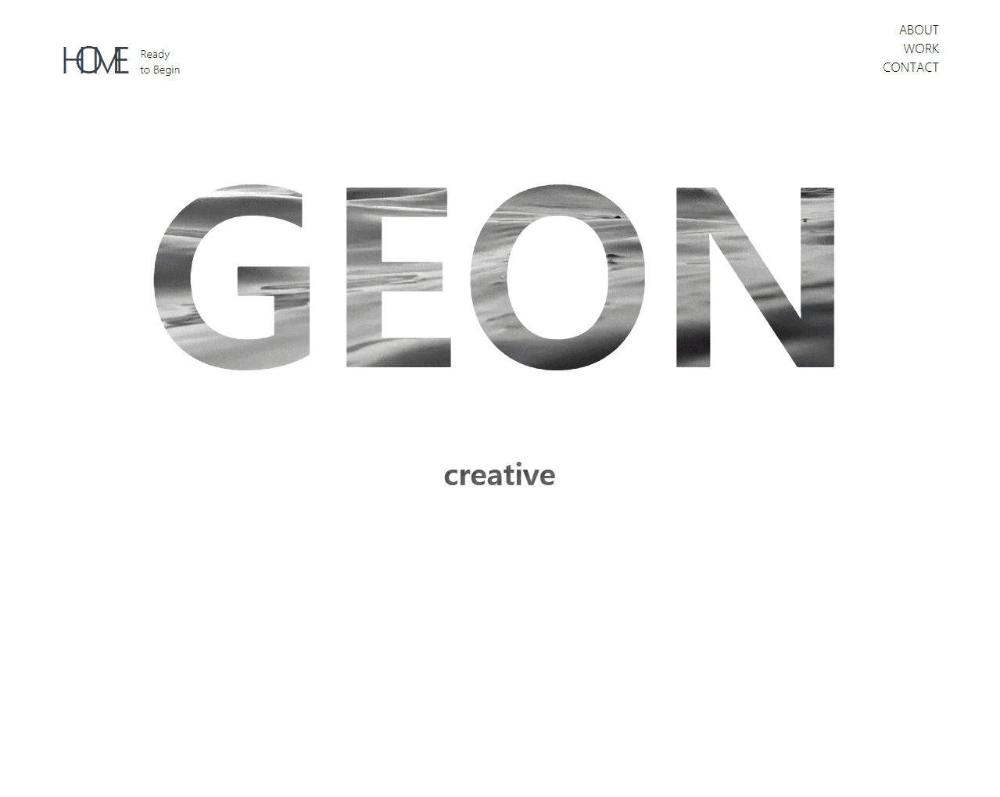
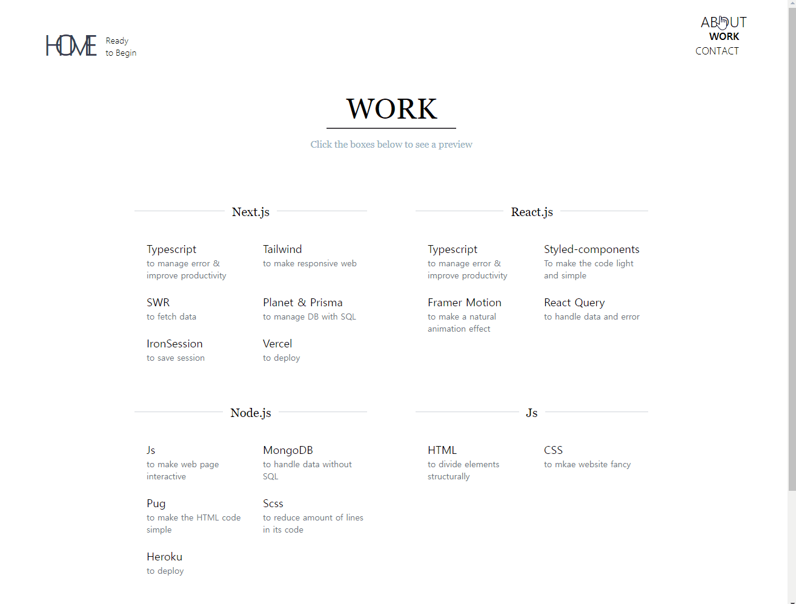
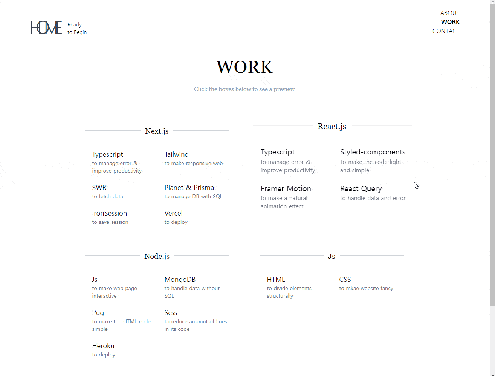
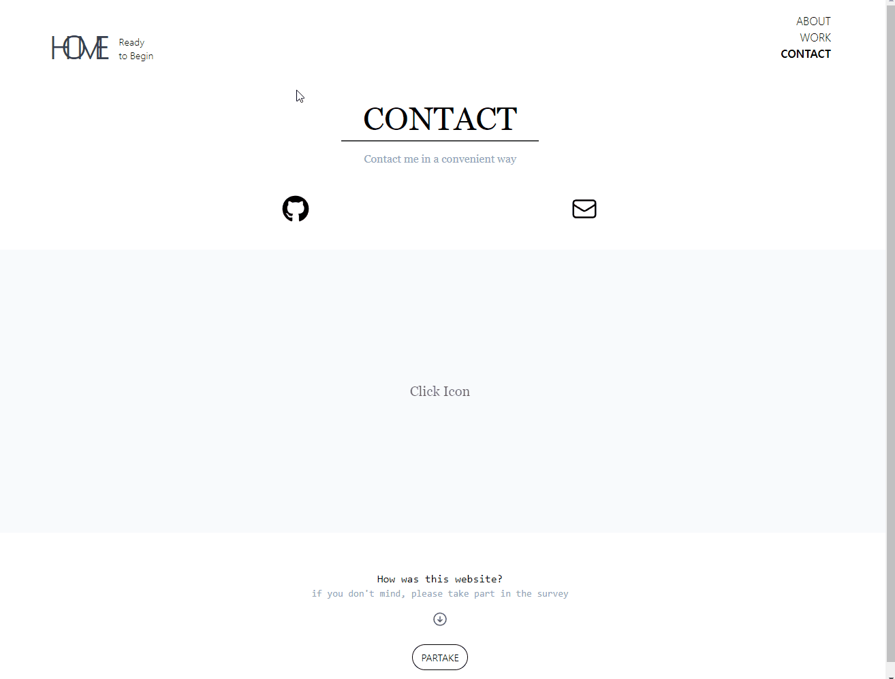

  <a href="https://profile-one-topaz.vercel.app">
    
     
    <a display="block" href="https://profile-one-topaz.vercel.app">이력서 이동</a>
  </a>

  

## Preview

> Home
- `background-clip: text` css 효과를 활용해 home 화면을 디자인 했음

 

  

    
  

  

> About
- framer motion 의 `useInView` hook 을 통해 text 컨테이너가 시야에 들어오면 노출되도록 하는 애니메이션 효과 적용
  

    
    
  

  

  
  

> Work
- 특정 컨테이너가 클릭 됐을 시 background-color 가 회색으로 변하고 work 의 detail component 가 노출되도록 함
  - framer motion 의 `layoutId` 를 활용하여 detail component 컨테이너의 아이디를 클릭된 박스에 따라 부여하여 클릭된 박스가 중앙으로 이동하는 것 처럼 애니메이션 구현
  
 

  

    
  

 
   

> Contact
- github, mail 아이콘 클릭 시 각자에 맞는 새탭이 열리도록 구현
- 아래 설문참여 버튼을 누르면 웹사이트에 대한 만족도 등의 설문이 진행되도록 구현
  - 웹사이트 보완을 위함
  
 

  

    
  

 
   

## Built with
Next.js / tailwindCss / framer-motion / typescript
